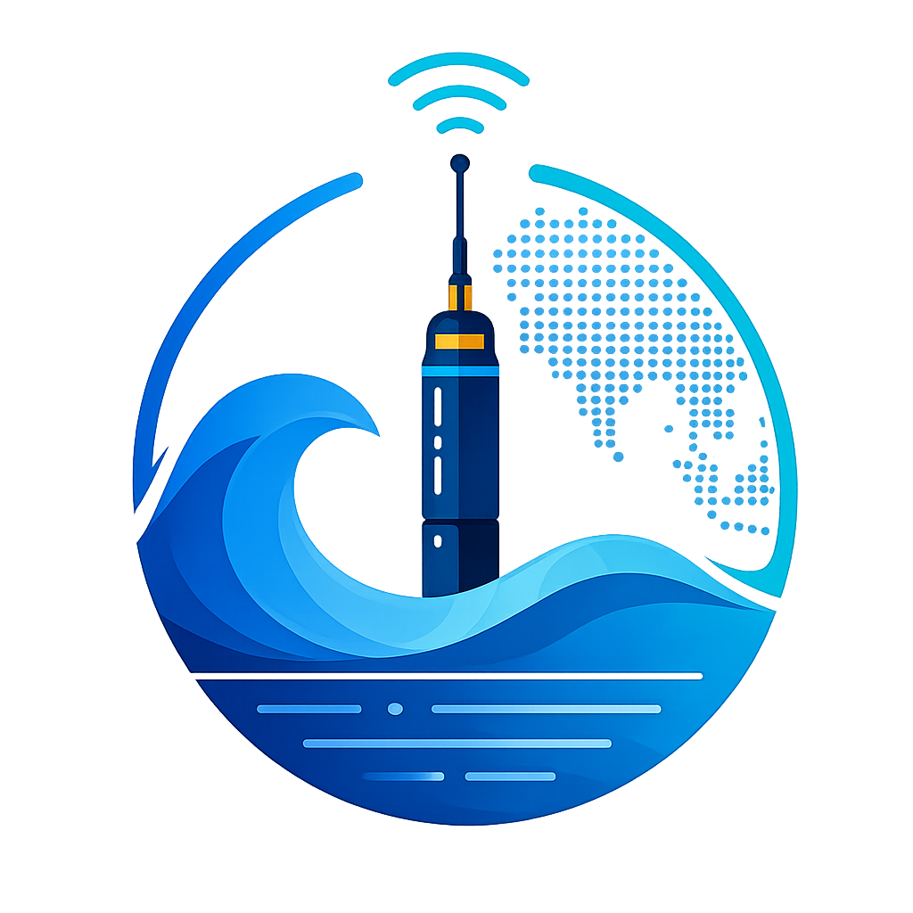

<div align="center">
  
  <h1>ArgoDeep</h1>
  <p><strong>An AI-native platform for exploring Argo float ocean data in natural language.</strong></p>
</div>

Ask questions like *"Show floats near India deployed after 2023 with max temperature above 25 °C"* and ArgoDeep plans the query, generates and validates SQL, reads depth profiles from Parquet, retrieves domain knowledge, draws charts, highlights floats on a live map, and explains the result — with citations and confidence.

---

## Overview

Argo is a global fleet of ~4,000 autonomous ocean floats. The raw data ships as
thousands of nested NetCDF files that are hard to explore. ArgoDeep turns that into a
conversational research tool: a **map-centric web app** backed by an **AI agent** that
orchestrates tools (SQL, DuckDB/Parquet, RAG) instead of guessing answers.

## Features

- 🗺️ **Interactive map** of every float — AI answers highlight/fit a subset in place.
- 🤖 **AI assistant** (global drawer **and** full page) — NL → SQL, charts, sources, confidence, warnings, follow-ups.
- 🔎 **Float Explorer** (sortable/searchable table) and rich **Float Details** (metadata, trajectory, depth profiles).
- 📊 **Analytics**, **Knowledge Base** (hybrid search), **SQL Playground** (read-only), **Dashboard**.
- 🔐 **Auth** (email + Google via Supabase) with **guest mode**; **conversation history** stored in Postgres and reusable without spending AI credits.
- 🌗 Light/dark themes, command palette (⌘K), responsive, toasts.

## Architecture

```
                 ┌──────────────── React (Vite) frontend ────────────────┐
                 │  Map · Assistant · Explorer · Analytics · SQL · …      │
                 └───────────────┬───────────────────────┬───────────────┘
        Supabase Auth / History  │  REST (/api/v1)        │  Supabase JS (RLS)
                                 ▼                         ▼
                 ┌──────────────── FastAPI backend ───────────────────────┐
                 │  Agent orchestrator (LLM tool-calling)                 │
                 │   ├─ sql_tool   → validate(sqlglot) → EXPLAIN → run RO │
                 │   ├─ duckdb_tool→ Parquet depth profiles              │
                 │   └─ knowledge  → hybrid RAG (pgvector + rerank)      │
                 │  → synthesizer (answer + chart + sources + confidence)│
                 └──────┬───────────────┬──────────────────┬─────────────┘
                        ▼               ▼                  ▼
                 Postgres+PostGIS    DuckDB over        pgvector
                 +pgvector (Supabase) Parquet (Storage) knowledge base
```

The AI pipeline is **intent-routed tool calling** — not every question becomes SQL
("What is DATA_MODE?" → knowledge only).

## Tech Stack

**Frontend:** React 19, TypeScript, Vite, Tailwind CSS v4, TanStack Query + Table,
Zustand, Framer Motion, React Router, Leaflet, Recharts, Lucide.
**Backend:** FastAPI, Python, psycopg2, sqlglot, DuckDB, pyarrow, sentence-transformers
(bge-small embeddings + cross-encoder rerank), Groq (Llama 3.3 70B) / Gemini 2.5 Flash.
**Data:** Supabase (Postgres + PostGIS + pgvector + Storage + Auth), Parquet.

## Folder Structure

```
Argo Float/
├─ frontend/web/            # React app (the product)
│  ├─ src/{pages,components,store,lib,providers,config}
│  └─ public/argo_logo.png
├─ backend/
│  ├─ app/                  # FastAPI: api, agents, tools, sql, duck, rag, llm
│  ├─ db/                   # schema.sql, observability.sql, conversations.sql
│  └─ etl/                  # modular ETL package + knowledge-base seeder

```

> **Preprocessing:** `backend/etl/` is the reusable, modular pipeline and **seeds the
> RAG knowledge base** (`python -m etl.knowledge`).

## Installation

```bash
# Backend
cd backend
python -m venv venv && venv\Scripts\activate      # Windows
pip install -r requirements.txt

# Frontend
cd ../frontend/web
npm install
```

## Environment Variables

**`backend/.env`** (see `backend/.env.example`): `DATABASE_URL`, `SUPABASE_URL`,
`SUPABASE_ANON_KEY`, `SUPABASE_SERVICE_ROLE_KEY`, `GROQ_API_KEY`, `GEMINI_API_KEY`
(optional), `LLM_PROVIDER`, `EMBEDDING_MODEL`, `PARQUET_BACKEND`, `SUPABASE_STORAGE_BUCKET`.

**`frontend/web/.env`** (see `.env.example`): `VITE_API_BASE`, `VITE_SUPABASE_URL`,
`VITE_SUPABASE_ANON_KEY`.

## Running Locally

```bash
# 1) One-time DB setup (Supabase SQL Editor): run backend/db/*.sql
# 2) Backend
cd backend && uvicorn app.main:app --reload        # http://127.0.0.1:8000
# 3) Frontend
cd frontend/web && npm run dev                      # http://localhost:5173
```

Ingest data (optional): download with `NetCDF files/get_nc.py`, then
`python -m etl.ingest` (local) ; seed
knowledge with `python -m etl.knowledge`.

## API Documentation

FastAPI Swagger at `/docs`. Key endpoints (`/api/v1`): `POST /ask` (agent),
`GET /floats`, `/floats/{id}`, `/floats/{id}/trajectory|param-stats|depth`,
`GET /knowledge`, `/stats/overview`, `/stats/coverage`, `POST /sql/run` (read-only),
`GET /schema`, `/logs`, `/health`.

## AI Pipeline

`/ask` → intent + entity extraction → tool orchestration:
- **knowledge_search** — hybrid RAG (pgvector dense + keyword, reranked) for definitions.
- **sql_query** — schema/example-aware generation → `sqlglot` AST validation → `EXPLAIN`
  → read-only execution (auto-repair retry).
- **profile_query** — DuckDB over Parquet for depth-resolved profiles.

Results are composed by a **synthesizer** that cites sources, never invents numbers,
and returns a chart spec, confidence, warnings, and follow-ups. Provider-agnostic LLM
client (Groq/Gemini) with automatic fallback.


<!-- ## Roadmap

- Subscriptions + metered AI credits ([`docs/FUTURE_PAYMENT_ARCHITECTURE.md`](docs/FUTURE_PAYMENT_ARCHITECTURE.md)).
- BGC parameters, multi-turn conversations, conversation export/sharing.
- Marker clustering & heatmaps, offline Parquet caching. -->

## References

- **Data:** Argo program — float data collected and made freely available by the
  International Argo Program and national programs (https://argo.ucsd.edu), distributed
  via **Ifremer GDAC** (https://data-argo.ifremer.fr). Argo is part of the Global Ocean
  Observing System.


